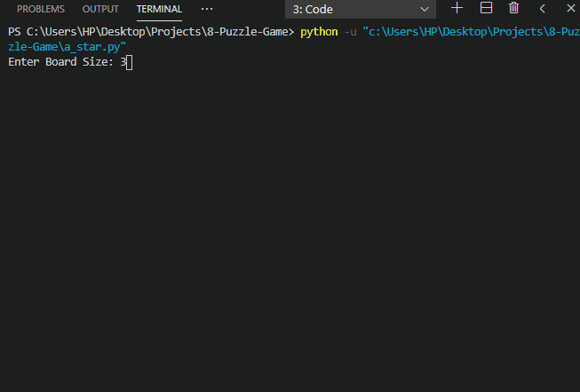

# N-Puzzle-Game
N-puzzle game in python 
user can play the game in console with controls : 'a' 'w' 's' 'd'  
Executing "8 puzzle.py" file user can play the game  
Executing "a_star.py" file A* algorithm with <i>Manhattan + Linear Conflict</i> cost function is used to solve the puzzle. 

  Hash function is used to check if the node is already explored or is considered to be explored. 
  Priority queue to select which node to be explored next based on the cost. 

<pre>
 +---+---+---+
 | 1 | 2 | 3 |
 +---+---+---+
 | 4 | 5 | 6 |
 +---+---+---+
 | 7 | 8 |   |
 +---+---+---+
</pre>

<h2>References</h2>

1. https://algorithmsinsight.wordpress.com/graph-theory-2/a-star-in-general/implementing-a-star-to-solve-n-puzzle/
2. https://ece.uwaterloo.ca/~dwharder/aads/Algorithms/N_puzzles/